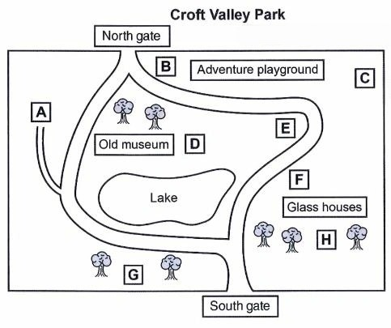

# IELTS Listening Section 2 & Map Labelling Masterclass

IELTS Listening টেস্টের **Section 2 (বা Part 2)**-এ সাধারণত একটি সামাজিক প্রেক্ষাপটে (Social Context) একজন স্পিকার কোনো একটি নির্দিষ্ট বিষয়, স্থান বা প্রজেক্ট নিয়ে দীর্ঘ বক্তব্য (Monologue) দেন। এই সেকশনে ভালো ব্যান্ড স্কোর নিশ্চিত করতে **Map/Plan Labelling** এবং এর সাথে জড়িত **Directional Connectors** এর নিখুঁত জ্ঞান থাকা আবশ্যক।

---

## 1. IELTS Listening Section 2: 

* **Context:** Non-academic / Social context (যেমন: কোনো পার্ক গাইড, মিউজিয়াম ট্যুর, ক্লাবের পরিচিতি, বা কোনো লোকাল প্রজেক্টের বর্ণনা)।
* **Speaker:** ১ জন (Monologue)। তবে মাঝেমধ্যে একজন রেডিও হোস্ট ভূমিকা দিতে পারেন, কিন্তু মূল তথ্য ১ জনই দেবেন।
* **Question Types:** 
  1. Map / Plan / Diagram Labelling (সবচেয়ে কমন)
  2. Multiple Choice Questions (MCQs)
  3. Matching Information

### 🎯 A Quick Overview of the IELTS Listening Structure

আইইএলটিএস লিসেনিং টেস্টে মোট ৪টি সেকশন থাকে। প্রতিটা সেকশনের প্রশ্নের ধরন এবং স্পিকারের সংখ্যা ভিন্ন হয়। নিচে এর একটি সম্পূর্ণ ব্রেকডাউন দেওয়া হলো:

| Feature | Section 1 | Section 2 | Section 3 | Section 4 |
| :--- | :--- | :--- | :--- | :--- |
| **Topic** | Phone Conversation  *(Course, Booking, Survey, etc.)* | Guide / Map | Academic Discussion | Lecture or  Presentation |
| **Questions** | 1 - 10 | 11 - 20 | 21 - 30 | 31 - 40 |
| **Question Type**| • Gap Filling *(Most times)* • Single MCQ *(Sometimes)* | • Maps • Single / Double MCQ • Box Matching / Flow Chart | • Maps • Single / Double MCQ • Box Matching / Flow Chart | • Gap Filling |
| **No. of Speakers**| **Speaker 2** *(Dialogue)* | **Speaker 1** *(Monologue)* | **Speaker 2/3** *(Discussion)* | **Speaker 1** *(Monologue)* |

---

## 2. Essential Connectors for Map and Plan Labelling

ম্যাপে সঠিক স্থানটি খুঁজে পাওয়ার জন্য স্পিকারের মুখের দিকনির্দেশনামূলক শব্দ বা কানেক্টরসগুলো ট্র্যাক করা সবচেয়ে গুরুত্বপূর্ণ। নিচে এগুলোকে ৩টি প্রধান ক্যাটাগরিতে ভাগ করে বিস্তারিত দেওয়া হলো:

### a) Compass Directions (প্রধান দিকসমূহ)
ম্যাপের ওপরে যদি কম্পাস (N, S, E, W) দেওয়া থাকে, তবে স্পিকার ডান/বাম না বলে দিক অনুযায়ী কথা বলবেন।

| Connector | Meaning (বাংলা অর্থ) | Usage / Example (ব্যবহারের উদাহরণ) |
| :--- | :--- | :--- |
| **North** | উত্তর দিক (ম্যাপের ওপরের অংশ) | The car park is located to the **north** of the main building. |
| **South** | দক্ষিণ দিক (ম্যাপের নিচের অংশ) | The picnic area lies just to the **south** of the lake. |
| **East** | পূর্ব দিক (ম্যাপের ডান দিক) | You will find the gift shop on the **east** side. |
| **West** | পশ্চিম দিক (ম্যাপের বাম দিক) | The residential blocks are to the far **west**. |
| **North-East** | উত্তর-পূর্ব (ওপরে-ডানে) | The playground is in the **north-east** corner. |
| **South-West** | দক্ষিণ-পশ্চিম (নিচে-বামে) | The entrance gate is situated in the **south-west**. |

### b) Relative Position Connectors (পারস্পরিক অবস্থান)
একটি নির্দিষ্ট স্থান বা বস্তুর সাপেক্ষে আরেকটি বস্তুর অবস্থান বোঝাতে এগুলো ব্যবহৃত হয়।

| Connector | Meaning (বাংলা অর্থ) | Usage / Example (ব্যবহারের উদাহরণ) |
| :--- | :--- | :--- |
| **Beside / Next to / By** | পাশে / একদম সংলগ্ন | The reception desk is **next to** the entrance. / The bench is **by** the tree. |
| **Near / Close to** | কাছে / অদূরে (একটু দূরত্ব থাকতে পারে) | The toilets are located **near** the cafeteria. |
| **Inside** | ভেতরে | Once you go **inside** the exhibition hall, you'll see the statue. |
| **Over / Above** | ওপরে (স্পর্শ না করে উঁচুতে / ব্রিজের মতো) | There is a wooden bridge **over** the river. |
| **Under / Below** | নিচে | The maintenance room is right **under** the stairs. |
| **Opposite / Face to face** | মুখোমুখি / বিপরীত পাশে | The library is **opposite** the science lab, across the corridor. |
| **In front of** | সামনে | A beautiful fountain stands **in front of** the main hall. |
| **Behind / At the back of** | পেছনে | The staff room is situated **behind** the stage. |

### c) Movement & Navigation Connectors (গতিপথ ও মোড়)
আপনি ম্যাপের কোন রাস্তা দিয়ে কীভাবে হেঁটে যাবেন বা কোন দিকে মোড় নিবেন, তা নির্দেশ করে।

| Connector | Meaning (বাংলা অর্থ) | Usage / Example (ব্যবহারের উদাহরণ) |
| :--- | :--- | :--- |
| **Towards** | দিকে / অভিমুখে | Walk **towards** the greenhouse and you will see the path. |
| **To** | পর্যন্ত / দিকে | Go straight **to** the end of the corridor. |
| **Bend** | বাঁক / মোড় (রাস্তার বাঁক) | Just before the **bend** in the river, there is a bird hide. |
| **Corner** | কোণ / কোণায় | The information desk is in the bottom right-hand **corner**. |
| **Roundabout** | গোলচত্বর | At the **roundabout**, take the first exit on your left. |
| **Go straight ahead** | সোজা সামনে এগিয়ে যান | **Go straight ahead** until you pass the fish pond. |
| **Turn left / Turn right** | বামে মোড় নিন / ডানে মোড় নিন | Pass the main gate and **turn right** onto the gravel path. |
| **Cross / Go across** | পার হওয়া (রাস্তা বা নদী) | **Go across** the footbridge to reach the orchard. |
| **Lead off** | কোনো রাস্তা থেকে নতুন রাস্তা বের হওয়া | There are three paths **leading off** the central courtyard. |

---

## 3. Text-Based Map Example (Interactive Script Walkthrough)

নিচের ম্যাপের লেআউট এবং অডিও স্ক্রিপ্টের উদাহরণটি লক্ষ্য করুন। এটি রিয়েল এক্সামের মতো আপনার কানকে ট্রেইন করতে সাহায্য করবে:

### 🗺️ Listening Map Audio

  <audio src="../assets/listening/croft-vally-park-map.m4a" controls></audio>

### 🗺️ Map Layout: 
<!-- PROFIESSONAL IMAGE EMBED -->

  

### Questions 11–16: Map Labeling

| No. | Location / Feature | Your Answer |
| :--- | :--- | :--- |
| **11** | café | |
| **12** | toilets | |
| **13** | formal gardens | |
| **14** | outdoor gym | |
| **15** | skateboard ramp | |
| **16** | wild flowers | |

---

### 🎧 Audio Script
As chair of the town council subcommittee on park facilities, I’d like to bring you up to date on some of the changes that have been made recently to the Croft Valley Park. So if you could just take a look at the map I handed out, let’s begin with a general overview. So the basic arrangement of the park hasn’t changed – it still has two gates, north and south, and a lake in the middle.

The café continues to serve an assortment of drinks and snacks and is still in the same place, looking out over the lake and next to the old museum. (Q11)

We’re hoping to change the location of the toilets, and bring them nearer to the centre of the park as they’re a bit out of the way at present, near the adventure playground, in the corner of your map. (Q12)

The formal gardens have been replanted and should be at their best in a month or two. They used to be behind the old museum, but we’re now used the space near the south gate – between the park boundary and the path that goes past the lake towards the old museum. (Q13)

We have a new outdoor gym for adults and children, which is already proving very popular. It’s by the glass houses, just to the right of the path from the south gate. You have to look for it as it’s a bit hidden in the trees. (Q14)

One very successful introduction has been our skateboard ramp. It’s in constant use during the evenings and holidays. It’s near the old museum, at the end of a little path that leads off from the main path between the lake and the museum. (Q15)

We’ve also introduced a new area for wild flowers, to attract bees and butterflies. It’s on a bend in the path that goes round the east side of the lake, just south of the adventure playground. (Q16)

---

## 4. Section 2-এ ব্যান্ড স্কোর ৭.০+ পাওয়ার প্রো-টিপস

1. **Start Point খুঁজে বের করুন:** স্পিকার কথা শুরু করার আগেই ম্যাপে চোখ বুলিয়ে দেখুন আপনার শুরুর অবস্থান কোথায়। সাধারণত **"You are here"**, **"Entrance"**, বা **"Main Gate"** দিয়ে শুরু হয়।
2. **পেন্সিল দিয়ে পয়েন্টার ট্র্যাক করুন:** অডিও চলার সময় আপনার পেন্সিলের মাথাটি ম্যাপের স্টার্টিং পয়েন্টে রাখুন এবং স্পিকার যেভাবে ডানে-বামে বা নর্থ-সাউথে যেতে বলবেন, পেন্সিলটি সেই অনুযায়ী ম্যাপের ওপর দিয়ে চালাতে থাকুন।
3. **Synonyms-এর দিকে খেয়াল রাখুন:** স্পিকার সরাসরি ম্যাপের শব্দ নাও বলতে পারেন। যেমন: *"Next to"* এর জায়গায় বলতে পারেন *"Alongside"* বা *"Adjoining"*। *"Behind"* এর জায়গায় বলতে পারেন *"At the rear of"*।
4. **Distractors থেকে সাবধান:** স্পিকার অনেক সময় ভুল তথ্য দিয়ে পরে তা সংশোধন করেন। যেমন: *"We initially planned to build the gym to the north, but instead, we decided to put it in the south."* তাই শেষ পর্যন্ত মনোযোগ দিয়ে শুনুন।

<!-- FOOTER -->
---

  <b>Let's Connect & Collaborate</b>

    <!-- LinkedIn -->

    <!-- Facebook -->

    <!-- Portfolio -->

    <!-- Blog -->

  
<!-- Animated Typewriter Text -->

     

---
