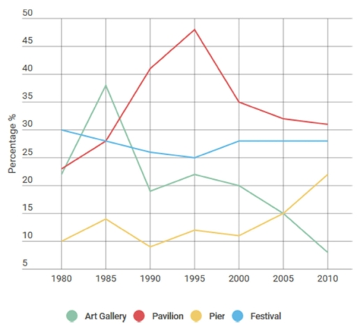

# IELTS Academic Writing Task 1: Line Chart Analysis

This module focuses on analyzing and describing data from a Line Chart in IELTS Academic Writing Task 1. To achieve a Band 7+ or higher, your report must follow a structured approach, including an introduction, overview, and specific data details.

---

## 📊 The Task Stimulus

The line graph shows the percentage of tourists to England who visited for different attractions in Brighton.

<!-- PROFIESSONAL IMAGE EMBED -->

  

*(The line graph provides information about visitor percentages across four distinct cultural venues—Art Galleries, Pavilions, Piers, and Festivals—over a 30-year period from 1980 to 2010.)*

---

## 📑 Structured Report Template (Band 7+)

### 1. Introduction (Paraphrase the Question in ONE SENTENCE)
* **Strategy:** Rewrite the question/title using synonyms. Change the sentence structure without changing the core meaning. At least 70-75% paraphrase, and it will be 1 sentence.
* **Key Vocabulary:** *illustrates, depicts, compares, reveals, trends, percentages, proportions.*

> **Introduction Example:**
> *"The line chart compares/demonstraites/illustrates the rates/resio of visitors to Brighton, England, who visited four various tourist spots from 1980 to 2010."*

### 2. General Overview (The Most Crucial Paragraph)
* **Strategy:** Summarize the main trends without mentioning specific numbers. Look for the highest/lowest points and overall directions (increase, decrease, or fluctuations).
* **Rule:** No percentages or years in this section—just the big picture!

> **Drafting Example:**
> *"Overall, it is clear that while the Pavilion and Pier attracted an increasing share of visitors over the period, attendance at Art Galleries experienced a sharp rise followed by a dramatic decline. Festivals remained relatively stable with a minor downward trend before recovering towards the end of the timeline."*

### 3. Body Paragraph 1: Detailed Data Analysis (Major Trends)
* **Strategy:** Focus on the dominant trends. For instance, describe the dramatic surge of Art Galleries in 1985 and the steady climb of Pavilions peaking in 1995. Use precise figures.

> **Drafting Example:**
> *"Looking at the details, Art Gallery attendance started at roughly 22% in 1980, followed by a dramatic surge to its peak at nearly 38% in 1985. However, this was followed by a sharp drop to under 20% in 1990, eventually plummeting to its lowest point at around 8% in 2010. In stark contrast, Pavilions saw a steady and significant climb, starting from just over 23% in 1980 and reaching a substantial peak of approximately 48% in 1995, before declining to 31% by 2010."*

### 4. Body Paragraph 2: Detailed Data Analysis (Minor/Other Trends)
* **Strategy:** Group the remaining data together (Piers and Festivals). Contrast their movements against the major trends described in Body Paragraph 1.

> **Drafting Example:**
> *"Regarding the other venues, Festivals began as the most popular attraction in 1980 at nearly 30%, but gradually decreased to a low of 25% in 1995, before leveling off and stabilizing at 28% through 2010. Conversely, Piers remained the least visited venue for most of the period, hovering between 9% and 14%, until a late surge brought its attendance up to just over 22% in 2010, surpassing Art Galleries."*

---

## 🛠️ Vocabulary Cheat Sheet for Line Graphs

| Trend Type | Verbs | Nouns | Adjectives / Adverbs |
| :--- | :--- | :--- | :--- |
| **Upward ↑** | Rose, Increased, Climbed, Surged, Peaked | A rise, An increase, A growth, A surge | Sharp, Dramatic, Steady, Significant |
| **Downward ↓** | Fell, Decreased, Declined, Dropped, Plummeted | A fall, A decrease, A decline, A drop | Slight, Gradual, Sharp, Steep |
| **Stability →** | Remained stable, Leveled off, Fluctuated | Fluctuations, Stability | Relatively, Marginally, Rapidly |

---
